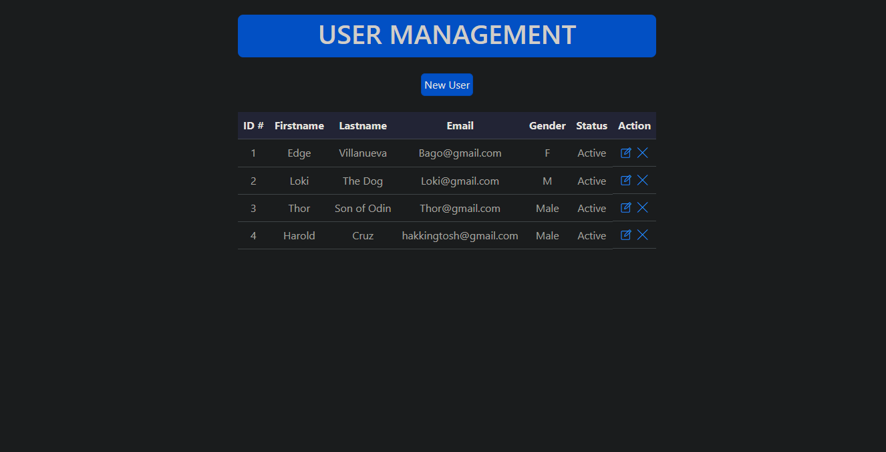

# SIMPLE USER MANAGEMENT

I built a user management system using the MERN stack. I used MongoDB database to store user data, and used Express to create an API for performing CRUD operations on that data.

## Functionality

User should be able to:

- Create. Remove. Update. Delete.

### Screenshot

### Links

- Live Site URL: [User Management](https://cruz-user-management.netlify.app/)

## My process

-I built a user management system using the MERN stack, focusing on the server side using MongoDB, Express, and Node.js. I set up a MongoDB database to store user data and used Express to create an API for performing CRUD operations on that data. This API handled requests such as creating new users, updating existing users, and deleting users. Additionally, I deployed the application on a server using technologies like Railway.app after Heroku ended its free service and MongoDB Atlas. I used netlify to deploy the website, to make it accessible from anywhere. Overall, it was a challenging but rewarding experience working with the server side of the MERN stack.

## Difficulties

As I built the user management system using the MERN stack, I faced some difficulties. One of the main challenges was handling the communication between the React front-end and the Express back-end. Since they are two different applications, I had to make sure that the correct data was being passed back and forth between them using Axios. I also had to ensure that the routes on the Express server matched the routes being accessed on the front-end, and that the correct data was being passed in the requests.

## My Solution

To overcome the difficulties faced while building the user management system using the MERN stack, I took the following measures:

- To handle the communication between the React front-end and the Express back-end, I made sure to thoroughly test all routes and requests using tools such as Postman, and also used proper error handling mechanisms in both the front-end and back-end code.

- To tackle the deployment challenges, I used Railway.app for easy deployment and scaling of the application. I also made sure to properly configure the server and environment variables to ensure the smooth running of the application.

- In terms of the user interface, I made sure to keep the design consistent and easy to navigate. I also made sure that the components were well-organized and easy to understand.

Overall, these measures helped me to handle the challenges and build a simple but functional user management system using the MERN stack.

### Built with

- [React](https://reactjs.org/) - JS library
- [Bootstrap](https://getbootstrap.com/) - For Styles
- [Mongoose](https://www.mongodb.com/developer/languages/javascript/getting-started-with-mongodb-and-mongoose/) - For Database
- [Express](https://www.mongodb.com/languages/express-mongodb-rest-api-tutorial) - For establishing API
- [NodeJS](https://nodejs.org/en/) - For running express
- [Axios](https://vishalghai.medium.com/mern-talks-how-to-use-axios-and-express-in-mern-stack-development-27e5a00de194) - For http requests
